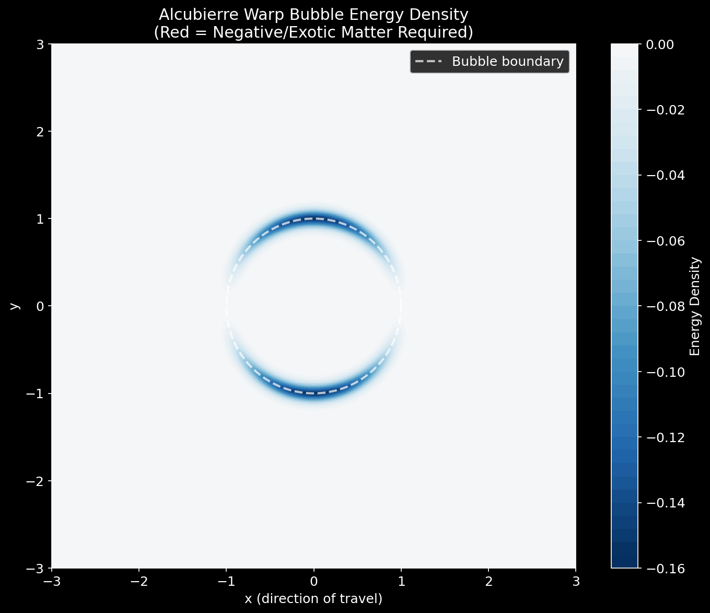
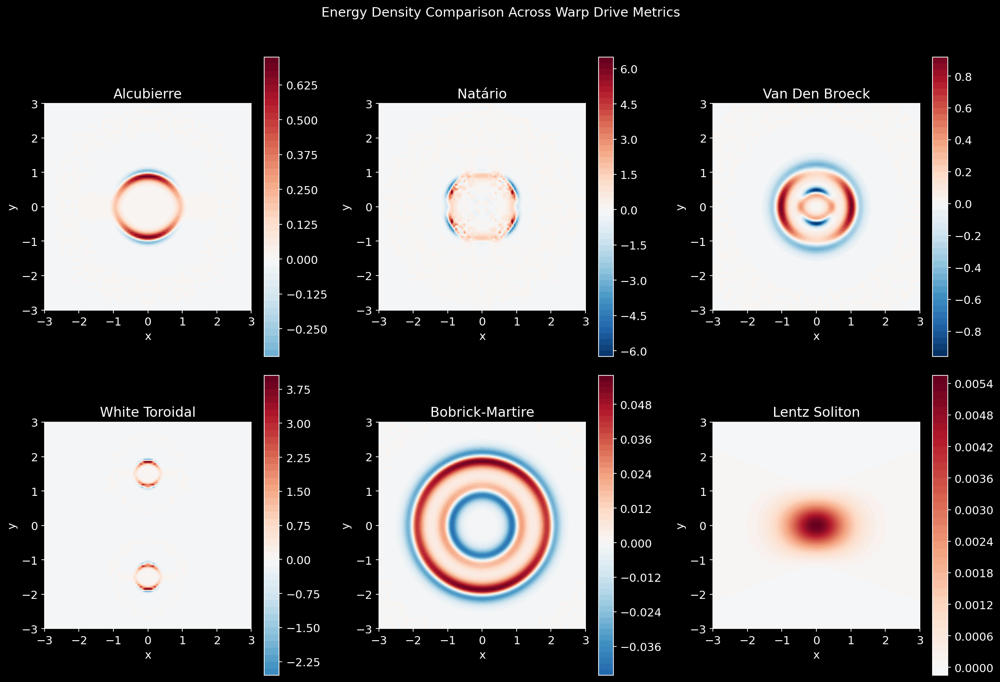
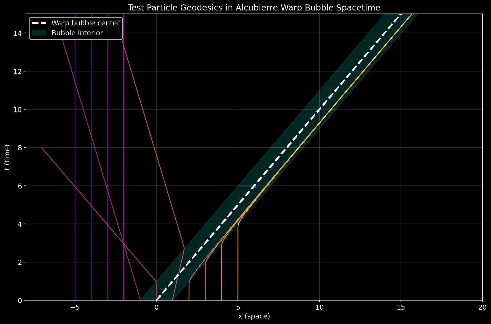
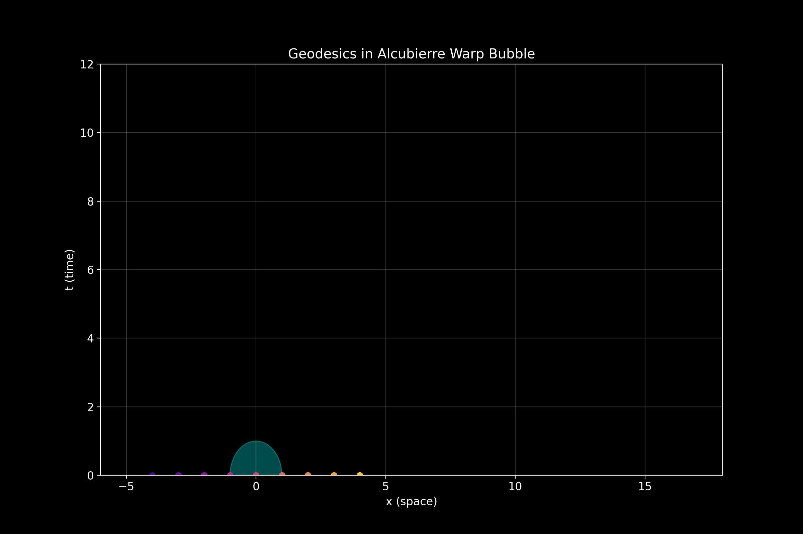
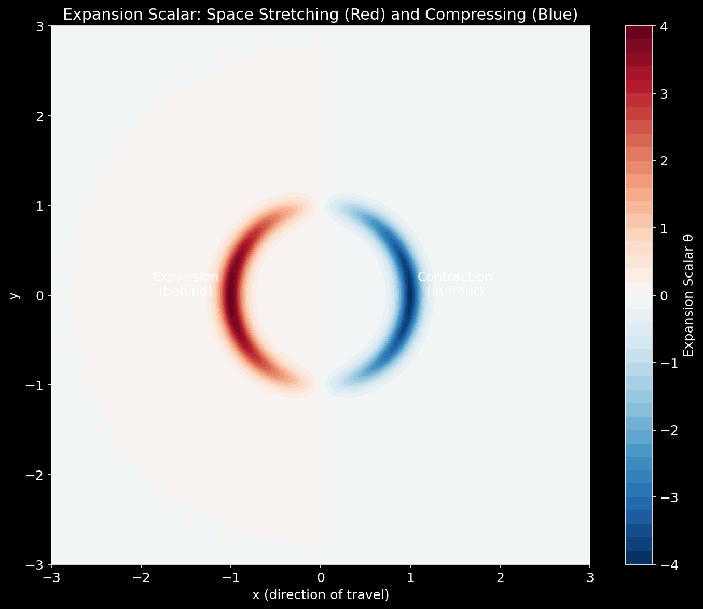
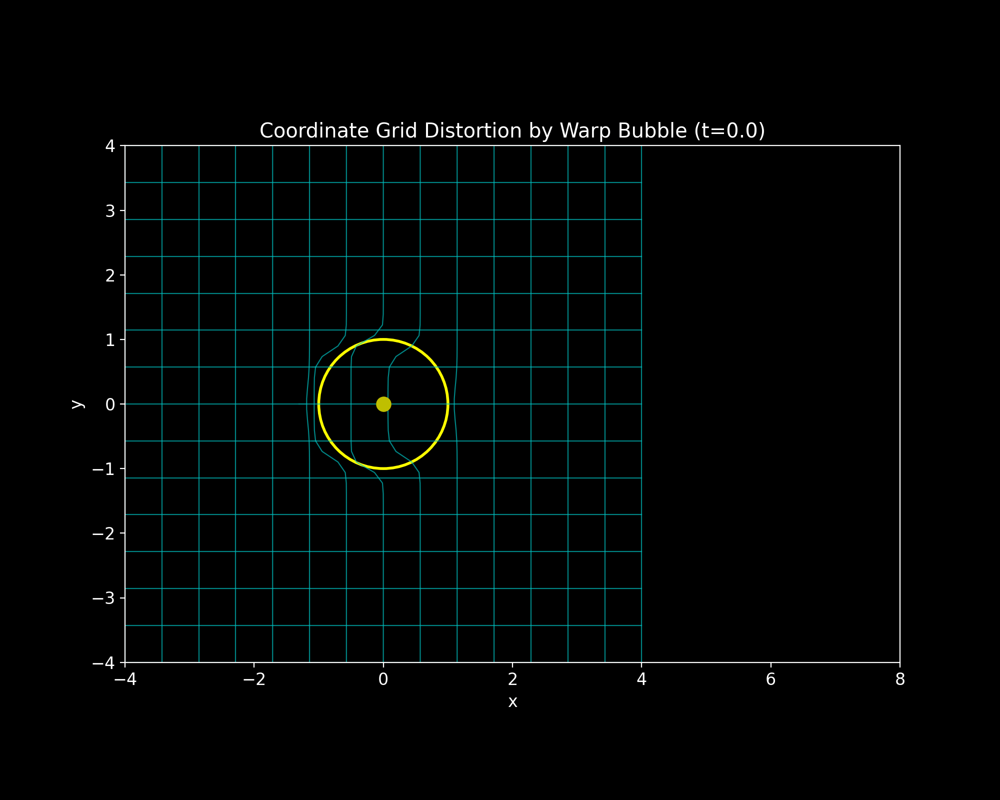
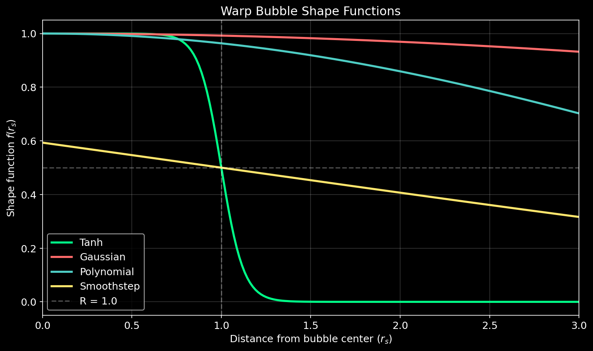
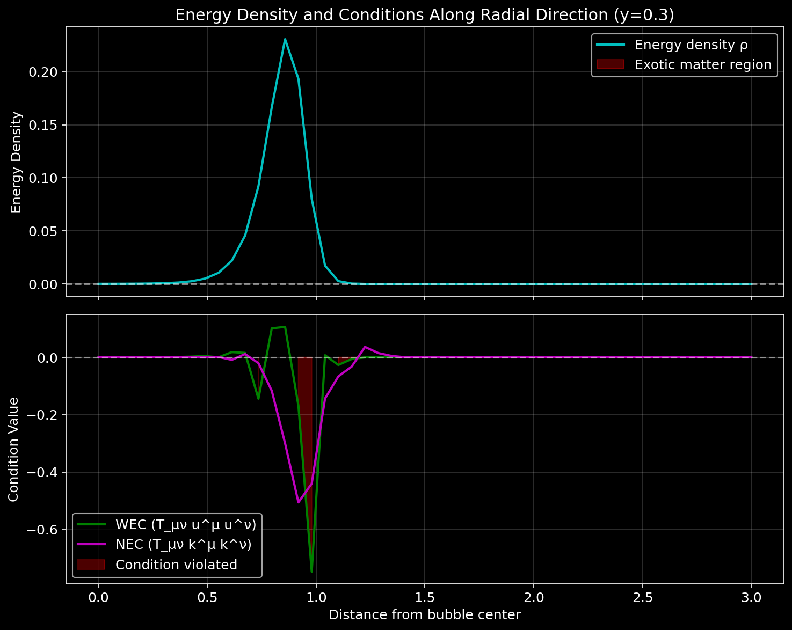
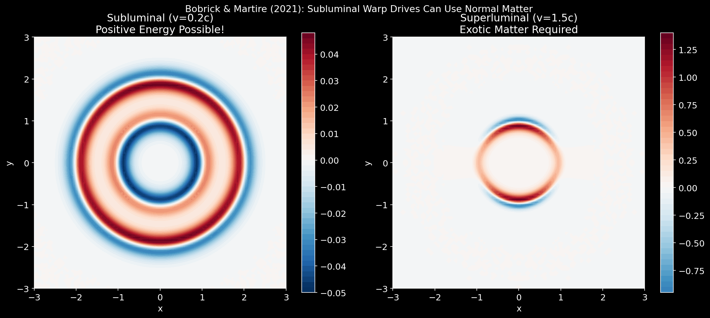

# WarpDrives

A Python library for simulating and visualizing General Relativistic warp bubble spacetimes.


<p align="center">
  
</p>

<p align="center">
  <em>3D visualization of an Alcubierre warp bubble warping spacetime as a spacecraft travels at the speed of light. The cyan grid shows the distortion of space - contracting in front and expanding behind the bubble. Red regions indicate where exotic matter (negative energy density) would be required.</em>
</p>

## Overview

WarpDrives provides tools for exploring the mathematics of warp drive spacetimes, including:

- **Alcubierre (1994)**: Classic warp bubble with shift vector construction
- **Natário (2002)**: Divergence-free shift vector (expansion-free)
- **Van Den Broeck (1999)**: Pocket modification for energy reduction
- **White toroidal**: Heuristic toroidal energy distribution [ASSUMPTION]
- **Bobrick & Martire (2021)**: Physical warp drives classification
- **Lentz (2021)**: Soliton warp drive [ASSUMPTION]

**Note**: This is a mathematical simulation tool. No claims about physical feasibility are made.

## Visualizations

### Alcubierre Warp Bubble Energy Density

The classic Alcubierre metric requires **negative energy density** (exotic matter) in the bubble wall region:



The red regions indicate where exotic matter is required - a fundamental challenge for physical realization.

### Metric Comparison

Comparison of energy density distributions across all six implemented warp drive metrics:



### Geodesics in Warp Bubble Spacetime

Test particles follow geodesics through the curved spacetime. Particles near the bubble are "swept along" by the warped space:





### Expansion and Contraction

The Alcubierre metric creates expansion of space behind the bubble and contraction in front:



### Grid Distortion

Visualization of how the warp bubble distorts the coordinate grid as it propagates:



### Top-Down Warp Field View

A clear top-down view showing the spacetime distortion and exotic matter distribution:


### Shape Functions

Different mathematical functions can define the bubble profile:



### Energy Conditions

Classical energy conditions are violated in the bubble wall:



### Subluminal vs Superluminal

Bobrick & Martire (2021) showed that **subluminal** warp drives can use positive energy, while superluminal drives require exotic matter:



## Interactive Simulator

**Try the warp drive simulator in your browser!** Open `interactive/index.html` to explore warp bubble physics interactively:

- Choose between 4 different warp drive metrics (Alcubierre, Natário, Van Den Broeck, Bobrick-Martire)
- Adjust velocity, bubble radius, and wall thickness in real-time
- Watch spacetime distortion, energy density distribution, and geodesic paths
- Toggle visualization layers: grid distortion, energy density, bubble outline, spacecraft

No installation required - just open the HTML file in any modern browser.

## Installation

```bash
# Clone the repository
git clone https://github.com/mthiel74/WarpDrives.git
cd WarpDrives

# Install with pip
pip install -e .

# Or with development dependencies
pip install -e ".[dev,notebooks]"
```

## Quick Start

### Python API

```python
from warpbubblesim.metrics import AlcubierreMetric
from warpbubblesim.gr import compute_einstein, compute_energy_density
from warpbubblesim.viz import plot_energy_density
import numpy as np

# Create an Alcubierre warp bubble
metric = AlcubierreMetric(v0=1.0, R=1.0, sigma=8.0)

# Get the metric tensor at a point
g = metric.metric(t=0, x=0, y=0, z=0)
print("Metric at center:", g)

# Compute energy density
metric_func = metric.get_metric_func()
coords = np.array([0, 1, 0.5, 0])  # In the wall region
rho = compute_energy_density(metric_func, coords)
print(f"Energy density: {rho:.4e}")  # Will be negative!

# Visualize
fig, ax = plot_energy_density(metric)
fig.savefig("energy_density.png")
```

### Command Line

```bash
# List available metrics
warpsim list-metrics

# Render field visualizations
warpsim render --metric alcubierre --scenario scenarios/alcubierre_demo.yaml --output out/

# Create geodesic animation
warpsim geodesics --metric alcubierre --output out/geodesics.mp4

# Parameter sweep
warpsim sweep --metric alcubierre --param v0 --values 0.1,0.5,1.0,2.0
```

## Examples

### 1. Compare Different Metrics

```python
from warpbubblesim.metrics import (
    AlcubierreMetric, NatarioMetric, BobrickMartireMetric
)
from warpbubblesim.viz import plot_multiple_fields

metrics = [
    AlcubierreMetric(v0=1.0),
    NatarioMetric(v0=1.0),
    BobrickMartireMetric(v0=0.5),
]

for metric in metrics:
    fig = plot_multiple_fields(metric, save_path=f"out/{metric.citation}.png")
```

### 2. Integrate Geodesics

```python
from warpbubblesim.metrics import AlcubierreMetric
from warpbubblesim.gr.geodesics import integrate_geodesic
import numpy as np

metric = AlcubierreMetric(v0=1.0)
metric_func = metric.get_metric_func()

# Initial conditions
x0 = np.array([0.0, -3.0, 0.0, 0.0])  # Start outside bubble
u0 = np.array([1.0, 0.0, 0.0, 0.0])   # Initially at rest

# Integrate
result = integrate_geodesic(metric_func, x0, u0, (0, 10))
print(f"Final position: {result['coords'][-1]}")
```

### 3. Check Energy Conditions

```python
from warpbubblesim.metrics import AlcubierreMetric
from warpbubblesim.gr.conditions import check_energy_conditions
import numpy as np

metric = AlcubierreMetric(v0=1.0, R=1.0)
metric_func = metric.get_metric_func()

# Check in the bubble wall
coords = np.array([0, 1.0, 0.3, 0])
conditions = check_energy_conditions(metric_func, coords)

for name, (satisfied, value) in conditions.items():
    status = "SATISFIED" if satisfied else "VIOLATED"
    print(f"{name}: {status} (value: {value:.2e})")
```

## Conventions

- **Metric signature**: (-,+,+,+)
- **Index ordering**: (t,x,y,z) = (0,1,2,3)
- **Units**: G = c = 1 (geometric units)
- **Einstein equations**: G_{\mu\nu} = 8\pi T_{\mu\nu}, so T_{\mu\nu} = G_{\mu\nu}/(8\pi)

## Documentation

- [Theory](docs/theory.md) - Mathematical foundations and equations
- [Metrics](docs/metrics.md) - Detailed metric descriptions
- [Numerics](docs/numerics.md) - Numerical methods
- [Visualizations](docs/visualizations.md) - Visualization guide

## Notebooks

Interactive Jupyter notebooks for each metric:

| Notebook | Description |
|----------|-------------|
| [00_quickstart.ipynb](notebooks/00_quickstart.ipynb) | Quick introduction to WarpDrives |
| [01_alcubierre.ipynb](notebooks/01_alcubierre.ipynb) | Deep dive into the Alcubierre metric |
| [02_natario.ipynb](notebooks/02_natario.ipynb) | Expansion-free Natário metric |
| [03_vdbroek.ipynb](notebooks/03_vdbroek.ipynb) | Van Den Broeck pocket geometry |
| [04_white_toroidal.ipynb](notebooks/04_white_toroidal.ipynb) | White's toroidal configuration |
| [05_bobrick_martire.ipynb](notebooks/05_bobrick_martire.ipynb) | Physical warp drives |
| [06_lentz.ipynb](notebooks/06_lentz.ipynb) | Lentz soliton warp drive |

## Testing

```bash
# Run all tests
make test

# Run specific test file
pytest tests/test_minkowski_limit.py -v
```

## Project Structure

```
WarpDrives/
├── warpbubblesim/
│   ├── gr/          # GR tensor computations
│   ├── metrics/     # Warp drive metric implementations
│   ├── viz/         # Visualization tools
│   └── cli/         # Command-line interface
├── tests/           # Test suite
├── notebooks/       # Jupyter notebooks
├── scenarios/       # YAML configuration files
├── images/          # Generated visualizations
└── docs/            # Documentation
```

## Citation

If you use this code in research, please cite:

```bibtex
@software{warpdrives,
  title = {WarpDrives: GR Warp Bubble Spacetime Simulator},
  year = {2024},
  url = {https://github.com/mthiel74/WarpDrives}
}
```

And the original papers for each metric (see [docs/references.bib](docs/references.bib)).

## License

MIT License - see [LICENSE](LICENSE) for details.

## Acknowledgments

This project implements metrics from:
- Alcubierre (1994)
- Natário (2002)
- Van Den Broeck (1999)
- Bobrick & Martire (2021)
- Lentz (2021)
- White (AIAA papers)

See the documentation for full references.
